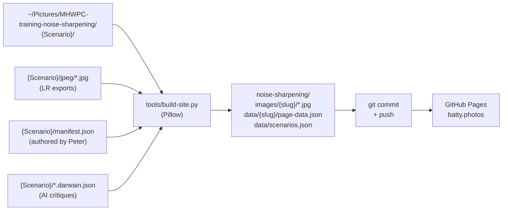

# feat: NR/sharpening/upsizing comparison site under batty.photos

## Overview

Build a static photo-comparison site to accompany Peter Batty's MHWPC digital training session on **May 11, 2026**. The site lets viewers examine, at full resolution, the same wildlife photograph processed through different noise-reduction / sharpening / upsizing tools (Lightroom AI Denoise, Topaz Photo, DxO PureRAW, ON1, etc.). Zoom-call screen sharing destroys the fine detail these comparisons depend on, so the website becomes both a live companion during the talk and a standalone reference afterward.

The site lives in the existing `battyphotos` repo and is served at the default GitHub Pages URL **`https://pmbatty.github.io/battyphotos/`** for v1. The custom domain `batty.photos` is deferred — it can be added later by dropping in a `CNAME` file and configuring DNS, with no code changes. The repo's root holds a small landing page; this comparison project lives under `noise-sharpening/`. Future presentations can be added as sibling subfolders.

Stack: vanilla HTML/CSS/JS on GitHub Pages, with a Pillow-only Python build script that consumes Lightroom-exported JPEGs from `~/Pictures/MHWPC-training-noise-sharpening/`. No frameworks, no build toolchain, no server.

**Two-pass shipping plan:**

- **v1 (target May 7):** Gallery + scenario detail pages with browse mode (image, title, caption, AI critique, pre-cropped 100% / 200% detail views). This is the floor for a presentable site on May 11.
- **v1.1 (target May 11):** Comparison mode — pick two variants, view side-by-side with synchronized pan/zoom (OpenSeadragon) plus a draggable before/after slider (img-comparison-slider).

If v1 lands cleanly with days to spare, v1.1 ships before the presentation. If it doesn't, the talk works on browse mode alone and comparison mode follows shortly after.

## Problem Statement

Wildlife photographers evaluating noise-reduction and sharpening tools need to look at fine detail — feather barbs, noise grain, sharpening halos — at native pixel resolution. Zoom screen-share compression and YouTube re-encoding both destroy exactly that information. A static website with full-resolution JPEGs and pre-cropped detail views solves it cleanly: viewers examine the actual pixels on their own displays.

Peter has already collected source material across five comparison scenarios (Spotted Owlet, Hummingbird1, Barred Owl, Burrowing Owls, Sandhill Crane) with RAW, TIFF, and DNG outputs from each tool, plus AI-generated critiques via [darwain](https://github.com/pmbatty/darwain) for most variants. The work that remains: get JPEGs out of Lightroom, run a build pipeline, and put a clean comparison UI on top.

## Research Findings

### Local research

- This is a fresh repo (`b0ebf24 Initial commit`), only `.gitattributes` and the requirements doc. No CLAUDE.md, no docs structure, no prior conventions to honor.
- Source folder confirmed at `~/Pictures/MHWPC-training-noise-sharpening/` with 5 scenarios. Spotted Owlet is the most complete and now has its `jpeg/` subfolder populated with 7 variants (master + 1 LR virtual copy + 4 TIFs + 1 DNG).
- All seven Spotted Owlet JPEGs are **2883×2162, RGB, embedded sRGB ICC profile**.
- Filename pattern at source: `{date}-{location}-{cameraID}{-Edit-N?}.{orf|tif|dng}`. darwain JSON: `{source_filename}.darwain.json`.
- **darwain JSON shape verified**, including virtual-copy handling:
  - `analyses` is an append-only chronological array.
  - Each analysis has a top-level `critique_text` (per-image), `potential_score` (1–5), `request.model`, `timestamp`.
  - **Virtual copies share the master's darwain JSON**, distinguished by a `copy_name` field on individual analyses (e.g., `"Copy 1"`). Master analyses lack the field. The Spotted Owlet `…Q1013570.orf.darwain.json` has 22 analyses — 11 master + 11 for Copy 1, paired by timestamp.
- **JPEG XMP carries `dc:title` and `dc:description`** populated by Lightroom from the photo's catalog metadata. Confirmed for all 7 Spotted Owlet JPEGs. This means title/caption are authored once in Lightroom and read directly from the JPEG — no duplication into manifest JSON.
- The original requirements doc's speculative variant mapping was wrong; the truth from EXIF: `Q1013570-2.jpg` (virtual copy) is `Lightroom Denoise`, `Edit-4.jpg` is `ON1 RAW` (so ON1 is already in the dataset, resolving an earlier open question).

### External research (May 2026)

- **OpenSeadragon synchronized viewers:** No built-in dual-viewer-with-sync mode, but the canonical pattern is well-documented and stable. Two `Viewer` instances; on `pan` / `zoom` events on viewer A, call `panTo()` / `zoomTo()` on viewer B (and vice versa), guarded by a flag to avoid feedback loops. Ian Gilman (OpenSeadragon maintainer) maintains a working CodePen demo. `OpenSeadragonImagingHelper` simplifies coordinate conversion for sync. Stable since ~v2.x; current version is v4.x.
- **img-comparison-slider** (sneas) is the dominant before/after slider library: web component, ~5 KB, framework-agnostic, native `<input type="range">` for keyboard accessibility, mobile-friendly. Drop-in via `` tags. Picked over alternatives (Image Compare Web Component, ptx-image-compare) because it's the most mature and battle-tested.
- **GitHub Pages custom domain:** Apex domain (`batty.photos`) requires four A records pointing to GitHub's load-balancer IPs (`185.199.108.153`, `109.153`, `110.153`, `111.153`) plus a `CNAME` file at the repo root containing `batty.photos`. HTTPS is auto-provisioned via Let's Encrypt once DNS validates. GitHub recommends also configuring a `www.batty.photos` CNAME → `pmbatty.github.io` for redirect coverage.

## Technical Approach

### Stack

- **Frontend:** Vanilla HTML, CSS (Grid + Flexbox), and modern JS (ES modules, `fetch`, `URLSearchParams`). No build step. No framework.
- **Image viewer:** [OpenSeadragon 4.x](https://openseadragon.github.io/) loaded from CDN — used for both browse-mode click-to-zoom and comparison-mode synchronized dual viewers.
- **Slider:** [img-comparison-slider](https://img-comparison-slider.sneas.io/) loaded from CDN for the before/after overlay view in comparison mode.
- **Build script:** Python 3.11+ with [Pillow](https://pillow.readthedocs.io/) plus [defusedxml](https://pypi.org/project/defusedxml/) (for XMP parsing — `Image.getxmp()` requires it). Two pure-Python deps total. No `rawpy`, `dcraw`, `darktable`, or `ExifTool` — Lightroom does the RAW conversion, Pillow + defusedxml does the rest.
- **Hosting:** GitHub Pages serving from `main` at `https://pmbatty.github.io/battyphotos/`. No custom domain in v1.

### Repository structure

```
battyphotos/                              # Repo root, served at https://pmbatty.github.io/battyphotos/
├── index.html                            # Top-level umbrella landing page
├── css/
│   └── site.css                          # Shared site-wide styles (typography, header)
├── tools/
│   ├── build-site.py                     # Build pipeline (reads source, writes images/data)
│   └── requirements.txt                  # Pillow only
├── docs/
│   ├── plans/                            # This plan + future plans
│   └── brainstorms/                      # Future use
├── README.md
├── comparison-website-requirements.md    # Living requirements doc
└── noise-sharpening/                     # The first comparison sub-project
    ├── index.html                        # Project landing / scenario gallery
    ├── scenario.html                     # Detail page (mode toggle: browse vs compare)
    ├── css/
    │   └── styles.css
    ├── js/
    │   ├── gallery.js                    # Renders scenarios.json on the gallery page
    │   ├── viewer.js                     # Browse mode: image grid, click-to-zoom, critique
    │   ├── comparison.js                 # Comparison mode: dual viewer + slider
    │   └── app.js                        # Bootstraps the right module per page/mode
    ├── data/
    │   ├── scenarios.json                # Index of scenarios for the gallery
    │   └── {scenario-slug}/
    │       └── page-data.json            # Merged manifest + critiques for the detail page
    └── images/
        └── {scenario-slug}/
            ├── thumbnail.jpg
            ├── {variant-slug}.jpg
            ├── {variant-slug}-crop-100.jpg
            └── {variant-slug}-crop-200.jpg
```

### Build pipeline



The script is idempotent and incremental: re-running with no source changes produces no diff. Re-running after Peter updates a manifest or re-exports JPEGs only rewrites affected files.

### Data shapes

**Source-side `manifest.json`** (authored by Peter, lives in each scenario folder under `~/Pictures/...` — minimal, scenario-level only):

```json
{
  "slug": "spotted-owlet",
  "title": "Spotted Owlet — ISO 10,000",
  "subtitle": "High-ISO test on the OM-1 micro four-thirds sensor. Fine feather detail and dark plumage stress noise reduction and sharpening simultaneously.",
  "detail_crop": { "x": 1200, "y": 800, "w": 600, "h": 400 },
  "hero_image": "Lightroom Denoise",
  "sort_order": 1,
  "image_order": [
    "RAW",
    "Lightroom Denoise",
    "Topaz Photo",
    "Topaz Photo 2",
    "Topaz Photo 3",
    "ON1 RAW",
    "DxO PureRAW 6"
  ]
}
```

Per-image **title and caption are not in the manifest** — they live in each JPEG's XMP (`dc:title`, `dc:description`), authored once in Lightroom. The build script reads them directly. `image_order` and `hero_image` reference the title strings (so Peter authors the same string he sees in Lightroom). `image_order` is optional; without it, the script falls back to natural filename sort.

The build script derives, for each JPEG in `jpeg/`:
- **Title and caption** from XMP `dc:title` / `dc:description`.
- **URL slug** = slugify(title) (e.g., `Lightroom Denoise` → `lightroom-denoise`). Errors on collisions within a scenario.
- **Master source file and `copy_name`** from the JPEG filename:
  - `{stem}.jpg` → master, `copy_name = None`. The master source file is whichever sibling has matching `{stem}.{orf|tif|dng}`.
  - `{stem}-N.jpg` (N ≥ 2) where `{stem}.jpg` also exists → virtual copy of `{stem}`, `copy_name = "Copy {N-1}"`.
- **darwain JSON path** = `{master source filename}.darwain.json` (alongside the source file, not in `jpeg/`).
- **Critique:** filter `analyses` by `copy_name`, take the entry with the latest `timestamp`, pull `critique_text`, `potential_score`, `request.model`, `darwain_version`. Null-safe when the JSON or matching analysis is absent.

**Built `page-data.json`** (one per scenario, lives in the repo at `noise-sharpening/data/{slug}/`):

```json
{
  "slug": "spotted-owlet",
  "title": "Spotted Owlet — ISO 10,000",
  "subtitle": "...",
  "image_dimensions": { "width": 2883, "height": 1922 },
  "detail_crop": { "x": 1200, "y": 800, "w": 600, "h": 400 },
  "previous_scenario": "burrowing-owls",
  "next_scenario": "hummingbird-1",
  "images": [
    {
      "slug": "raw",
      "title": "RAW",
      "caption": "Original RAW with no editing, shot at ISO 10,000.",
      "display": "images/spotted-owlet/raw.jpg",
      "crop_100": "images/spotted-owlet/raw-crop-100.jpg",
      "crop_200": "images/spotted-owlet/raw-crop-200.jpg",
      "critique": {
        "text": "As the original unprocessed RAW file shot at ISO 10,000, this image serves as the baseline...",
        "potential_score": 1,
        "model": "gemini-3.1-pro-preview",
        "darwain_version": "0.9.0",
        "timestamp": "2026-05-02T15:27:44Z"
      }
    },
    {
      "slug": "lightroom-denoise",
      "title": "Lightroom Denoise",
      "caption": "Lightroom's new AI Denoise with default setting of 50",
      "display": "images/spotted-owlet/lightroom-denoise.jpg",
      "crop_100": "images/spotted-owlet/lightroom-denoise-crop-100.jpg",
      "crop_200": "images/spotted-owlet/lightroom-denoise-crop-200.jpg",
      "critique": {
        "text": "Lightroom's AI Denoise has performed exceptionally well here...",
        "potential_score": 5,
        "model": "gemini-3.1-pro-preview",
        "darwain_version": "0.9.0",
        "timestamp": "2026-05-02T15:27:44Z"
      }
    }
  ]
}
```

The `critique` object groups every field derived from darwain — `text`, `potential_score` (1–5), and provenance (`model`, `darwain_version`, `timestamp`). It's `null` when no darwain JSON exists for the variant or no analysis matches the `copy_name`. The UI renders conditionally: `if (image.critique) { renderStars(image.critique.potential_score); renderText(image.critique.text); ... }`.

**Built `scenarios.json`** (single index for the gallery):

```json
[
  {
    "slug": "spotted-owlet",
    "title": "Spotted Owlet — ISO 10,000",
    "subtitle": "...",
    "thumbnail": "images/spotted-owlet/thumbnail.jpg",
    "variant_count": 6,
    "sort_order": 1
  }
]
```

### Frontend architecture

**Three pages, two real ones:**

- `/` (root `index.html`) — umbrella landing page. Brief intro to batty.photos, single card linking to `/noise-sharpening/`. Future siblings get added here.
- `/noise-sharpening/` (`noise-sharpening/index.html`) — gallery page. Reads `data/scenarios.json`, renders cards with thumbnail + title + variant count.
- `/noise-sharpening/scenario.html?id={slug}` — scenario detail. Reads `data/{slug}/page-data.json`. Mode toggle between **browse** and **compare** (URL-driven: `?mode=browse|compare&a={slug}&b={slug}`).

**Mode toggle, single page, two JS modules.** `app.js` reads the query string, fetches `page-data.json`, then hands off to `viewer.js` (browse) or `comparison.js` (compare). The page can refresh between modes via URL change without losing context.

**Browse mode UI (`viewer.js`):**

- Header with scenario title and subtitle, prev/next-scenario links, mode toggle.
- A list of variants. Each entry shows:
  - Display image at fit-to-content-width, click opens an OpenSeadragon overlay for full-detail pan/zoom.
  - Title, caption.
  - Star rating (1–5) from `potential_score`, plus a small "AI" badge with model attribution.
  - AI critique paragraph in a `<details>` element (collapsed by default, expanded when present). If `critique_text` is null, the block is omitted entirely.
  - Pre-cropped 100% and 200% detail views shown side-by-side beneath each variant. These are the killer feature for at-a-glance pixel comparison.

**Comparison mode UI** — implemented v1.1 (May 2):

The original plan envisioned two presentations (sync-zoom side-by-side AND a slider), a picker UI, and dedicated comparison page state. Peter scoped this down to a simpler first-pass that lives inside the existing lightbox:

- Click any non-baseline variant in the grid → lightbox opens in **comparison mode**: baseline (first variant in display order, e.g. RAW) underneath, the clicked variant on top with a vertical clip-path divider revealing one or the other.
- Click the baseline itself → existing single-image lightbox (nothing to compare against).
- Two stacked OpenSeadragon viewers, viewports synced bidirectionally via mirrored `pan` / `zoom` / `animation` event handlers with a shared `syncing` guard.
- Draggable circular handle on the divider; arrow keys nudge, Shift+arrow for larger steps, Home/End for full extremes, double-click to reset to 50%.
- Side-corner badges (`RAW` / `<variant>`) so the user always knows which side is which.
- The 1:1 button drives both viewers via the sync, still DPR-aware.
- **No A/B picker yet** — that's the next iteration. Future sketch: dropdowns or thumbnail strip in the lightbox bar that swap either viewer's tile source without re-mounting the lightbox.

**Why a single lightbox shell:** click flow stays identical (click image, see comparison), no separate page state to coordinate, OSD viewports + clip-path keep all the zoom semantics working without duplication.

### Hosting & deployment

- Repo is `pmbatty/battyphotos`. GitHub Pages source: `main` branch, `/` directory. Live URL: `https://pmbatty.github.io/battyphotos/`.
- HTTPS is on by default for `*.github.io` URLs — no extra configuration.
- No CI step needed — push to `main` deploys. Build runs locally before each push (`python tools/build-site.py`).
- **All internal links MUST be relative** (e.g., `noise-sharpening/index.html`, not `/noise-sharpening/`) so the site works at the project-pages base path `/battyphotos/...`. Same code drops onto a custom domain later with zero edits.

### Migrating to `batty.photos` later (deferred, not in scope)

When Peter wants to flip on the custom domain: add a `CNAME` file at repo root containing `batty.photos`, configure four A records on the apex domain (`185.199.108.153`, `109.153`, `110.153`, `111.153`) and a `CNAME` for `www` pointing to `pmbatty.github.io`, then enable "Enforce HTTPS" in repo Pages settings. No code changes needed if all links are relative.

## Implementation Phases

### Phase 0 — Repo skeleton + GitHub Pages (May 2)

**Estimated effort: 30 minutes.** Confirm hosting works end-to-end before any real content.

- [x] Add minimal `index.html` at repo root with a placeholder linking to `noise-sharpening/` (relative path)
- [x] Add placeholder `noise-sharpening/index.html` with "Coming soon"
- [x] Add `.gitignore` (entries for `.DS_Store`, Python `__pycache__`, `.venv/`)
- [x] Add stub `README.md`
- [x] Push to GitHub, enable Pages from `main` branch in repo settings
- [x] Verify `https://pmbatty.github.io/battyphotos/` loads the placeholder
- [x] Verify `https://pmbatty.github.io/battyphotos/noise-sharpening/` loads its placeholder

### Phase 1 — Build pipeline (May 3)

**Estimated effort: 4–6 hours.** Foundation. Without this, no images get on-site.

- [x] Set up `tools/build-site.py` with argparse (`--source ~/Pictures/MHWPC-training-noise-sharpening`, `--out .`, `--scenario {slug}` for partial rebuilds)
- [x] Read `manifest.json` (scenario-level: slug, title, subtitle, detail_crop, hero_image, sort_order, optional image_order); validate required fields with clear error messages
- [x] Walk `{scenario}/jpeg/*.jpg`. For each JPEG:
  - [x] Read XMP via `Image.getxmp()` (requires `defusedxml`); extract `dc:title` and `dc:description`. Error if title is missing.
  - [x] Derive slug from title; error on collisions within the scenario
  - [x] Determine master source file + `copy_name` from the JPEG filename pattern (master vs `-N` virtual copy)
  - [x] Copy to `noise-sharpening/images/{scenario-slug}/{slug}.jpg` (no recompression — LR export is already the right size/quality)
  - [x] Crop the `detail_crop` rectangle from the JPEG, save as `{slug}-crop-100.jpg` (quality=92)
  - [x] Upscale that crop 2× (bilinear), save as `{slug}-crop-200.jpg` (quality=92)
  - [x] Load `{master_source_filename}.darwain.json`; filter `analyses` by `copy_name`; take the latest by timestamp; pull `critique_text`, `potential_score` (1–5 int), `request.model`, `darwain_version`, `timestamp` into the nested `critique` object. Null-safe when missing.
- [x] Order variants by `image_order` if provided (matching titles), else by JPEG filename
- [x] Generate `noise-sharpening/images/{scenario-slug}/thumbnail.jpg` from the JPEG whose title matches `hero_image`, resized to 600px wide
- [x] Write `noise-sharpening/data/{scenario-slug}/page-data.json` (titles, captions, slugs, image paths, critiques, prev/next links computed from `sort_order`)
- [x] Write `noise-sharpening/data/scenarios.json` (gallery index)
- [x] Idempotency: skip rewriting files when source mtime ≤ output mtime; `--force` flag to override
- [x] Author the first manifest (`~/Pictures/MHWPC-training-noise-sharpening/Spotted Owlet/manifest.json`) using the minimal schema. Spotted Owlet is the smoke test
- [x] Run end-to-end against Spotted Owlet → verify 7 variants render with correct titles/captions/critiques

#### `tools/build-site.py` (sketch)

```python
# Pseudocode — see Phase 1 acceptance criteria for full behavior
def build(source_root: Path, out_root: Path, scenario_filter: Optional[str] = None):
    scenarios = []
    for scenario_dir in sorted(source_root.iterdir()):
        if not (scenario_dir / "manifest.json").exists():
            continue
        manifest = json.loads((scenario_dir / "manifest.json").read_text())
        if scenario_filter and manifest["slug"] != scenario_filter:
            continue
        page_data = build_scenario(scenario_dir, manifest, out_root)
        write_page_data(page_data, out_root)
        scenarios.append(scenario_index_entry(manifest, page_data, out_root))
    write_scenarios_index(scenarios, out_root)

def build_scenario(scenario_dir, manifest, out_root):
    images_out = out_root / "noise-sharpening" / "images" / manifest["slug"]
    images_out.mkdir(parents=True, exist_ok=True)
    crop = manifest["detail_crop"]
    variants = []
    for jpeg_path in sorted((scenario_dir / "jpeg").glob("*.jpg")):
        with Image.open(jpeg_path) as im:
            xmp = im.getxmp()  # requires defusedxml
        title, caption = read_title_caption(xmp)            # dc:title, dc:description
        slug = slugify(title)
        master_filename, copy_name = resolve_source(jpeg_path, scenario_dir)
        critique = load_critique(scenario_dir / f"{master_filename}.darwain.json", copy_name)
        copy_display(jpeg_path, images_out / f"{slug}.jpg")
        write_crop(jpeg_path, crop, images_out / f"{slug}-crop-100.jpg", upscale=1)
        write_crop(jpeg_path, crop, images_out / f"{slug}-crop-200.jpg", upscale=2)
        variants.append(VariantData(slug, title, caption, critique, jpeg_path.name))
    variants = order_variants(variants, manifest.get("image_order"))
    write_thumbnail(images_out / "thumbnail.jpg",
                    pick_jpeg_for_title(scenario_dir, manifest["hero_image"]))
    return assemble_page_data(manifest, variants)

def resolve_source(jpeg_path: Path, scenario_dir: Path) -> tuple[str, Optional[str]]:
    """Map a JPEG filename to (master_source_filename, copy_name).
    `Q1013570.jpg`     → (`Q1013570.orf` or .tif or .dng, None)
    `Q1013570-2.jpg`   → (matching master, "Copy 1")  -- only if `Q1013570.jpg` also exists
    """
    ...

def load_critique(darwain_json: Path, copy_name: Optional[str]) -> Optional[dict]:
    """Returns the nested 'critique' dict for the page-data, or None when absent.

    Picks the most recent analysis whose `copy_name` matches (None for masters,
    "Copy 1" / "Copy 2" / ... for virtual copies). potential_score is a 1-5
    integer rating from darwain.
    """
    if not darwain_json.exists():
        return None
    data = json.loads(darwain_json.read_text())
    matching = [a for a in data.get("analyses", [])
                if a.get("copy_name") == copy_name]  # None matches None
    if not matching:
        return None
    latest = max(matching, key=lambda a: a.get("timestamp", ""))
    return {
        "text": latest.get("critique_text"),
        "potential_score": latest.get("potential_score"),  # int, 1-5
        "model": latest.get("request", {}).get("model"),
        "darwain_version": latest.get("darwain_version"),
        "timestamp": latest.get("timestamp"),
    }
```

### Phase 2 — Gallery landing page (May 4 morning)

**Estimated effort: 2–3 hours.**

- [x] `noise-sharpening/index.html`: header, intro paragraph, scenario grid container
- [x] `noise-sharpening/css/styles.css`: card styles, responsive grid (1 col mobile, 2 col tablet, 3 col desktop)
- [x] `noise-sharpening/js/gallery.js`: fetch `data/scenarios.json`, render cards with thumbnail / title / subtitle / variant count, link to `scenario.html?id={slug}`
- [x] Intro copy: what the site is, why it exists, link to MHWPC, link to darwain attribution
- [x] Test with the Spotted Owlet scenario already built

### Phase 3 — Scenario detail page, browse mode (May 4 afternoon – May 5)

**Estimated effort: 4–6 hours.**

- [x] `noise-sharpening/scenario.html`: shared shell with mode toggle, container for content
- [x] `noise-sharpening/js/app.js`: read `?id` from URL, fetch `data/{id}/page-data.json`, hand off to viewer.js
- [x] `noise-sharpening/js/viewer.js`: render variant list — for each image:
  - [x] Display JPEG with click-to-open OpenSeadragon overlay (full pan/zoom)
  - [x] Title, caption
  - [x] Star rating (1–5) from `potential_score`
  - [x] Collapsible AI critique (`<details>`) showing `critique_text`, with a small attribution line for the model
  - [x] 100% and 200% detail crops side-by-side
- [x] OpenSeadragon overlay: fixed-position modal, esc-to-close, single viewer with default controls
- [x] Previous/next scenario links in the header (driven by `previous_scenario` / `next_scenario` in page-data)
- [x] Mobile layout: stack everything vertically; detail crops one above the other

### Phase 4 — v1 polish & content (May 6) — ships ~May 7

**Estimated effort: 3–4 hours.**

- [ ] Have Peter export JPEGs from Lightroom for all five scenarios into their `jpeg/` subfolders. Titles and captions are already in Lightroom's photo metadata and travel with the JPEG export — no JSON authoring per image.
- [ ] Author one minimal manifest per scenario (slug, title, subtitle, detail_crop, hero_image, sort_order, optional image_order). 5 small JSON files
- [ ] Run the build for all scenarios
- [x] Top-level `index.html` cleanup: real intro for batty.photos, real card for the noise-sharpening project
- [x] Loading states (skeleton or "Loading…" text while fetches resolve)
- [x] Empty/error states: graceful "AI critique not yet available" when null
- [x] Responsive QA on iPad-size and phone-size viewports
- [ ] Lighthouse pass (perf, accessibility, SEO basics)
- [ ] Smoke test on Safari (Peter's likely browser), Chrome, Firefox
- [x] **Ship v1** — push to main, verify live at batty.photos

### Phase 5 — Comparison mode: sync zoom (May 8)

**Estimated effort: 6–8 hours.** This is the trickiest piece.

- [ ] `noise-sharpening/js/comparison.js`: read `?mode=compare&a=X&b=Y`, fetch page-data, render two-image picker (dropdowns) + view container
- [ ] Two OpenSeadragon viewers, each pointed at one variant's display JPEG
- [ ] Synchronized pan/zoom following the [Ian Gilman pattern](https://codepen.io/iangilman/pen/BpwBJe):
  - [ ] On viewer A pan/zoom, snapshot `getCenter()` and `getZoom()`, call equivalents on viewer B (and vice versa)
  - [ ] Guard with `_syncing` flag to prevent feedback loops
  - [ ] Use the same `defaultZoomLevel`, `homeFillsViewer`, and `minZoomLevel` settings on both
- [ ] Mode toggle button to switch between "Sync zoom" and "Slider" (both modes share the picker and detail crops below)
- [ ] Detail crops for A and B shown beneath the comparison (100% and 200%)
- [ ] Both A's and B's titles, captions, and critiques visible alongside (collapsible)

### Phase 6 — Comparison mode: slider + final polish (May 9–10) — ships by May 11

**Estimated effort: 4–6 hours.**

- [ ] Slider mode: `` web component with both display JPEGs as `` and ``, sized to fit container
- [ ] Click-to-zoom-to-full from slider mode also opens OpenSeadragon overlay
- [ ] Comparison mode mobile fallback: stack viewers vertically; consider hiding sync-zoom on phones (slider works fine)
- [ ] Browser QA on Chrome, Safari, Firefox; iPad
- [ ] Final pass on intro copy, attribution to darwain
- [ ] Optional: keyboard shortcuts (`A`/`B` to swap variants, `←`/`→` for prev/next scenario)
- [ ] **Ship v1.1** by May 10 evening, leaving May 11 morning as buffer before the talk

## Acceptance Criteria

### Functional — v1 (browse mode)

- [ ] `https://pmbatty.github.io/battyphotos/` loads over HTTPS and shows the umbrella landing page
- [ ] `https://pmbatty.github.io/battyphotos/noise-sharpening/` shows a gallery card for every scenario with a manifest
- [ ] Clicking a card opens `scenario.html?id={slug}` and renders all variants
- [ ] All internal links are relative — site works regardless of base path
- [ ] Each variant shows: display image (click-to-zoom), title, caption, star rating, AI critique (when present), 100% crop, 200% crop
- [ ] Scenarios with no darwain critique render cleanly with no broken UI elements
- [ ] Previous/next scenario navigation works between all scenarios
- [ ] Mobile (iPhone-size) layout is usable, even if not optimal

### Functional — v1.1 (comparison mode)

- [ ] Mode toggle on the scenario page switches between browse and compare without a full reload
- [ ] In compare mode, two-variant picker selects any two variants from the scenario; URL reflects state
- [ ] Sync-zoom view: panning/zooming either viewer drives the other in lockstep; no jitter or feedback loops
- [ ] Slider view: draggable divider reveals one image vs the other, keyboard-accessible via the underlying range input
- [ ] Both critiques and detail crops shown beneath the comparison

### Non-functional

- [ ] Page load (gallery): under 1.5 s on a typical home connection (cards are tiny — thumbnails dominate)
- [ ] Scenario page: full-res JPEG fetch can be lazy/deferred until visible; crop JPEGs preloaded
- [ ] No JavaScript errors in browser console under any normal flow
- [ ] Lighthouse accessibility score ≥ 90 on the gallery and scenario pages
- [ ] Repo size under 500 MB (estimated ~50–150 MB at full content)

### Quality gates before May 11

- [ ] All five scenarios have manifests authored, JPEGs exported, and build passes cleanly
- [ ] Peter has reviewed every scenario page in a browser and signed off on titles/captions/crops
- [ ] Comparison mode has been used end-to-end against at least three scenarios
- [ ] Test passes on Safari (most likely projection browser), Chrome, Firefox

## File-by-file scope

| Path | Purpose | Phase |
|------|---------|-------|
| `index.html` | Umbrella landing | 0 + 4 |
| `.gitignore` | `.DS_Store`, `__pycache__/`, `.venv/` | 0 |
| `css/site.css` | Shared header/typography | 0 + 4 |
| `tools/build-site.py` | Pillow + defusedxml build pipeline | 1 |
| `tools/requirements.txt` | `Pillow>=10.0`, `defusedxml>=0.7` | 1 |
| `noise-sharpening/index.html` | Gallery shell | 2 |
| `noise-sharpening/css/styles.css` | Project styles | 2–4 |
| `noise-sharpening/js/gallery.js` | Renders scenarios.json | 2 |
| `noise-sharpening/js/app.js` | Routes browse vs compare | 3 |
| `noise-sharpening/js/viewer.js` | Browse mode | 3 |
| `noise-sharpening/js/comparison.js` | Compare mode | 5–6 |
| `noise-sharpening/scenario.html` | Detail page shell | 3 |
| `noise-sharpening/data/scenarios.json` | Built by script | 1 |
| `noise-sharpening/data/{slug}/page-data.json` | Built by script | 1 |
| `noise-sharpening/images/{slug}/*.jpg` | Built by script | 1 |
| `~/Pictures/.../{Scenario}/manifest.json` | Authored by Peter | 1 + 4 |
| `~/Pictures/.../{Scenario}/jpeg/*.jpg` | Lightroom exports | 1 + 4 |

## Risks & Mitigations

| Risk | Likelihood | Impact | Mitigation |
|------|------------|--------|------------|
| Internal links accidentally absolute (`/foo` instead of `foo`) and break under `/battyphotos/` base path | Medium | Medium | Convention enforced in code review; smoke-test the live `pmbatty.github.io/battyphotos/` URL after every deploy, not just localhost |
| Lightroom export naming doesn't match expected stem | Low | Medium | Build script logs missing JPEGs clearly with the path it expected; Peter can adjust LR export filename template |
| Detail-crop coordinates wrong for a scenario (e.g., off the edge of a smaller variant) | Medium | Medium | Build script validates crop fits within image bounds; explicit error per variant. Peter can iterate quickly |
| OpenSeadragon sync-zoom feedback loops | Medium | Low (visible jitter) | `_syncing` guard flag in handlers; well-documented pattern from upstream maintainers |
| ON1 / Burrowing Owls / Sandhill Crane data not ready by May 11 | Medium | Low | Site renders only what's in the manifests; missing scenarios are simply absent from the gallery. No code change needed |
| v1.1 (comparison mode) doesn't ship in time | Low | Low | v1 still works for the talk. Comparison mode lands shortly after |
| Repo size grows unexpectedly | Low | Low | <100 images × ~2 MB ≈ 200 MB ceiling, well under GitHub's 1 GB limit |
| `.DS_Store` files in source folder confuse the build | Low | Low | Build script ignores hidden files explicitly |

## Dependencies

### External libraries (CDN, no local install)

- [OpenSeadragon 4.x](https://openseadragon.github.io/) — image viewer with pan/zoom
- [img-comparison-slider](https://img-comparison-slider.sneas.io/) — before/after slider web component

### Python (build-time only)

- [Pillow](https://pillow.readthedocs.io/) ≥ 10.0
- [defusedxml](https://pypi.org/project/defusedxml/) ≥ 0.7 — required by `Image.getxmp()` to safely parse the JPEG XMP packet for `dc:title` / `dc:description`

### Infrastructure

- GitHub Pages (free tier, no Git LFS, default `*.github.io` URL — no custom domain in v1)
- Adobe Lightroom Classic (Peter's existing setup) for JPEG exports

### Content (Peter's responsibility)

- Lightroom JPEG exports for all variants in all scenarios (titles + captions already authored on the photos in Lightroom and travel along in the JPEG XMP — no per-image JSON to write)
- One minimal `manifest.json` per scenario (slug, title, subtitle, detail_crop, hero_image, sort_order, optional image_order)
- Decision on remaining open questions (Burrowing Owls / Sandhill Crane completion before launch)

## Open Questions Still Needing Answers

These are documented in the requirements doc and remain non-blocking for v1, but worth nailing before launch:

- **Burrowing Owls / Sandhill Crane:** Few or no darwain critiques. Build script handles missing critiques gracefully. Question is whether to ship those scenarios in v1 with no AI commentary, or hold them for later.
- **Detail-crop coordinates:** Peter eyeballs the rectangle per scenario. Process: open one of the LR-exported JPEGs in Preview/Photoshop, note pixel coordinates of a diagnostic region (the eye, a feather edge), put them in the manifest. We can iterate on these.
- **Mobile comparison mode:** Acceptable to degrade to "browse only" on phones, or worth investing in a vertical-stacked comparison? Recommend defer.

## Future Considerations

These don't shape v1 architecture but should remain feasible as the site grows:

- **More comparison projects under battyphotos**: the umbrella structure already supports `noise-sharpening/`, future siblings (e.g., `lens-comparison/`, `field-techniques/`). Shared `css/site.css` and a thin top-level landing page keep cross-linking simple.
- **Per-scenario explanatory content (markdown):** if Peter wants long-form discussion alongside, a markdown-rendered intro per scenario fits cleanly into the page-data schema.
- **Custom domain `batty.photos`:** can be flipped on at any time after v1 ships — drop in a `CNAME` file, configure DNS A records on the apex + CNAME on `www`, enable "Enforce HTTPS". Zero code changes needed if all internal links stayed relative.
- **YouTube companion:** site URLs would be linked from the talk's video. Scenario pages have stable URLs — `https://pmbatty.github.io/battyphotos/noise-sharpening/scenario.html?id=spotted-owlet` (or under `batty.photos` later).
- **Quantitative metrics (SNR, MTF):** if Peter computes these later, a `metrics: {...}` object on each variant in the manifest would render alongside the AI critique.
- **Dynamic darwain re-analysis:** if Peter re-runs darwain with newer models, just re-run the build — the pipeline pulls the latest from `analyses[-1]` automatically.
- **Toggle between darwain analyses:** instead of always using `analyses[-1]`, a future UI dropdown could let users compare model outputs over time. Easy to add — the data is already in the source darwain JSONs.

## References

### Internal

- [comparison-website-requirements.md](../../comparison-website-requirements.md) — living requirements doc
- darwain JSON example inspected: `~/Pictures/MHWPC-training-noise-sharpening/Spotted Owlet/2025-05-12-Bandhavgarh-Q1013570-Edit-2.tif.darwain.json`
- darwain project: https://github.com/pmbatty/darwain

### External

- [OpenSeadragon 4.x](https://openseadragon.github.io/)
- [OpenSeadragon synchronized viewers — Ian Gilman demo](https://codepen.io/iangilman/pen/BpwBJe)
- [OpenSeadragon multi-viewer sync issue thread](https://github.com/openseadragon/openseadragon/issues/1483)
- [img-comparison-slider docs](https://img-comparison-slider.sneas.io/)
- [img-comparison-slider repo](https://github.com/sneas/img-comparison-slider)
- [GitHub Pages — managing a custom domain](https://docs.github.com/en/pages/configuring-a-custom-domain-for-your-github-pages-site/managing-a-custom-domain-for-your-github-pages-site)
- [GitHub Pages — apex domain DNS setup](https://docs.github.com/en/pages/configuring-a-custom-domain-for-your-github-pages-site/managing-a-custom-domain-for-your-github-pages-site#configuring-an-apex-domain)
- [Pillow Image.crop / Image.resize](https://pillow.readthedocs.io/)
- MHWPC presentation: May 11, 2026
